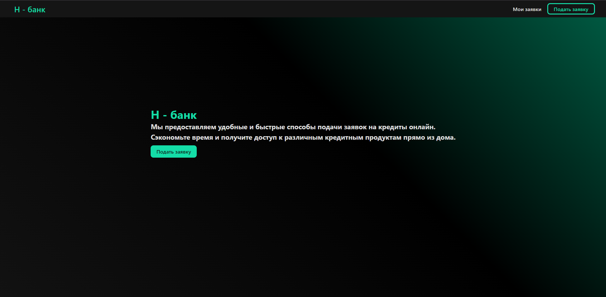

## Описание

Данная программа была разработанна в качестве frontend для проекта "credit-service-backend"

## Требования

- Node - 18v

## Установка зависимостей

```bash
$ npm install
```

## Запуск проекта

```bash
$ npm run build
```

```bash
$ npm run preview
```

## Страницы

<ul>
  <li>
    <p>Главная</p>
    </li>
  <li>
    <p>Форма отправки заявки</p>
    
  </li>
  <li>
    <p>Форма отправки заявки (Валидация)</p>
    
  </li>
  <li>
    <p>Форма поиска своих заявок</p>
    
  </li>
  <li>
    <p>Список найденных заявок</p>
    
  </li>
</ul>
